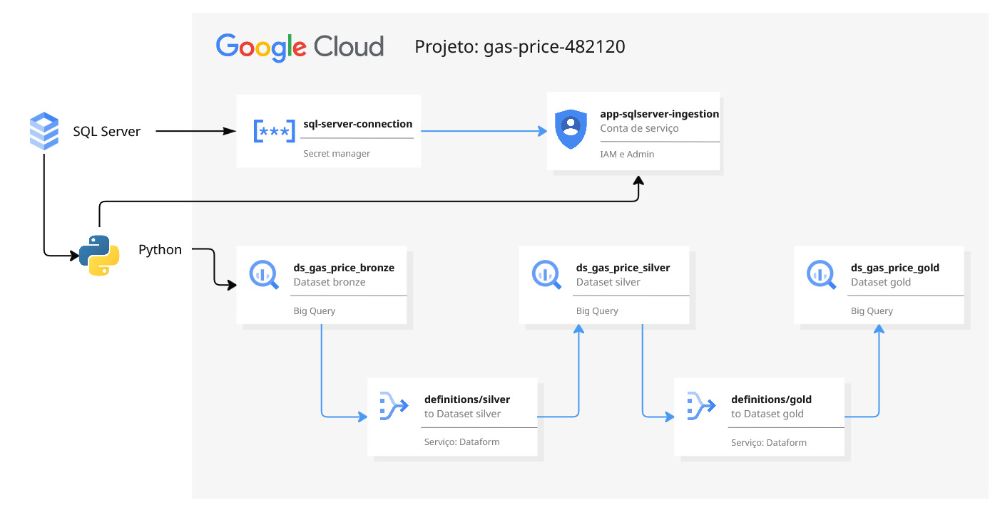

# SQL Server → BigQuery (Arquitetura Medallion com Dataform)

Pipeline de Engenharia de Dados que realiza ingestão incremental de dados de um banco SQL Server para o BigQuery (camada Bronze) e transformação analítica nas camadas Silver e Gold utilizando Dataform.

O projeto simula um cenário real de sincronização de dados on-premise → cloud, com controle de registros novos, alterados e removidos.

---

## 📐 Arquitetura



**Fluxo:**
- SQL Server (origem)
- Python → ingestão incremental (camada Bronze – BigQuery)
- Dataform → transformações Silver e Gold
- BigQuery → camadas analíticas prontas para consumo

---

## 🛠️ Tecnologias

- Python  
- Google BigQuery  
- Google Secret Manager  
- Dataform  
- SQL Server  
- Pandas  
- pyodbc  

---

## 🧪 Pipeline de Ingestão (Bronze)

O pipeline em Python executa:

- Carga inicial (primeira execução)
- Identificação de:
  - registros novos  
  - registros alterados  
  - registros removidos  
- Sincronização incremental no BigQuery  
- Controle de `ingestion_timestamp`

Arquivo principal:
```

ingestion/main.py

```

---

## 🔄 Transformações (Silver / Gold – Dataform)

### Silver  
Normalização e tipagem dos dados brutos:

- Conversão de tipos  
- Padronização de campos  
- Filtros de qualidade  
- Incremental por `dt_ingestao`

Exemplo:
```

dataform/definitions/silver/tb_silver_preco_gasolina_mensal_2013_2019.sqlx

```

---

### Gold  
Modelo analítico final:

- União de períodos históricos  
- Criação de chave surrogate (FARM_FINGERPRINT)  
- Dimensões temporais (ano, mês, nome do mês)  
- Métricas consolidadas para análise

Exemplo:
```

dataform/definitions/gold/tb_gold_precos_combustiveis_mensal.sqlx

````

---

## ▶️ Como rodar o projeto

### 1️⃣ Criar e ativar ambiente virtual

```bash
python -m venv venv
.\venv\Scripts\Activate.ps1
````

### 2️⃣ Instalar dependências

```bash
pip install -r ingestion/requirements.txt
```

### 3️⃣ Configurar credenciais

Defina as variáveis de ambiente:

```bash
setx GOOGLE_APPLICATION_CREDENTIALS "CAMINHO/DA/SUA/CHAVE.json"
setx PROJECT_ID "gas-price-482120"
```

### 4️⃣ Executar ingestão

```bash
python ingestion/main.py
```

---

## 🔐 Segurança

* Conexão com SQL Server via Secret Manager
* Nenhuma credencial versionada no repositório
* Variáveis sensíveis via ambiente (.env ou variáveis do sistema)

---

## 📁 Estrutura do projeto

```
sqlserver-to-bigquery-medallion/
│
├── dataform/
│   ├── definitions/
│   │   ├── bronze/
│   │   ├── silver/
│   │   └── gold/
│   ├── includes/
│   └── workflow_settings.yaml
│
├── ingestion/
│   ├── config.py
│   ├── database.py
│   ├── google_client.py
│   ├── main.py
│   └── requirements.txt
│
├── diagrams/
│   └── architecture.png
│
├── .gitignore
└── README.md
```

---

## 🚀 Próximos passos

* Orquestração com Cloud Composer / Airflow
* Substituir deletes linha-a-linha por MERGE no BigQuery
* Criação de camada de métricas para BI
* Monitoramento de falhas e reprocessamento automático
